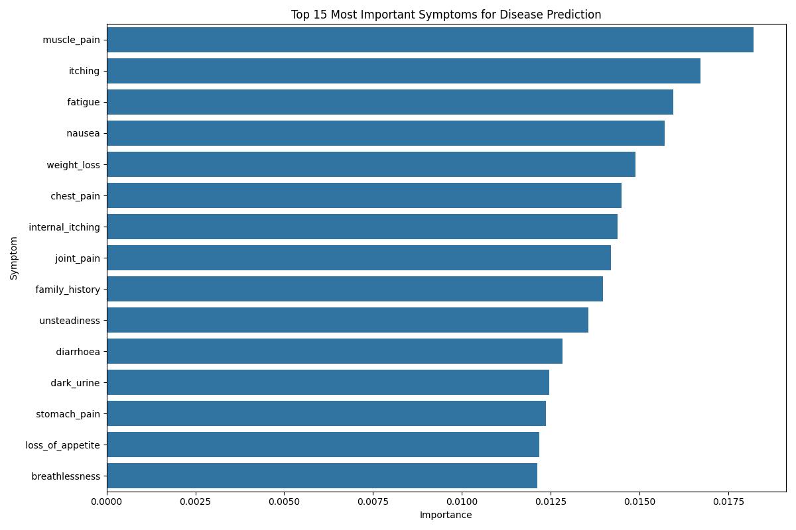

# healthcare: AI-Powered Disease Prediction System

A machine learning-based system for predicting diseases based on symptoms, designed specifically for the Nigerian healthcare context where access to medical professionals may be limited.



## Overview

MediPredict  is an innovative healthcare solution that uses advanced machine learning algorithms to identify possible diseases based on patient-reported symptoms. Designed to address the healthcare challenges in Nigeria, where the doctor-to-patient ratio is approximately 1:5,000 (far below the WHO recommended 1:600), this system serves as a preliminary diagnostic tool to assist both healthcare workers and patients.

The system analyzes symptom patterns, evaluates their severity, and provides multiple possible diagnoses with confidence scores, detailed descriptions, and recommended precautions. By leveraging artificial intelligence for healthcare diagnostics, MediPredict aims to reduce diagnostic delays, minimize the risks of self-medication, and optimize the use of limited healthcare resources, particularly in underserved rural communities.

## Features

- **Intelligent Symptom Matching**: Identifies possible diseases from user-provided symptoms
- **Multiple Disease Predictions**: Shows several potential diagnoses with confidence scores
- **Severity Assessment**: Evaluates the severity of symptoms
- **Detailed Disease Information**: Provides descriptions and recommended precautions for each disease
- **Interactive Web Interface**: User-friendly interface with symptom selection and results display
- **Symptom Suggestions**: Recommends additional symptoms to check based on initial selections

## Technology Stack

- **Backend**: Python with Flask web framework
- **Machine Learning**: Scikit-learn with Random Forest classifier
- **Data Processing**: NumPy, Pandas
- **Frontend**: HTML, CSS, JavaScript, jQuery, Bootstrap, Select2
- **Data Visualization**: Matplotlib, Seaborn

## Dataset

The system uses multiple datasets:
- `dataset.csv`: Contains diseases and their associated symptoms
- `symptom_Description.csv`: Provides detailed descriptions of diseases
- `symptom_precaution.csv`: Lists recommended precautions for each disease
- `Symptom-severity.csv`: Contains severity scores for different symptoms

## Installation

1. Clone the repository:
```
git clone https://github.com/sashanth-13/MedNova.git

```

2. Install required packages:
```
pip install -r requirements.txt
```

3. Train the model (optional, as a pre-trained model is included):
```
python disease_prediction_model.py
```

4. Run the application:
```
python app.py
```

5. Open a web browser and navigate to:
```
http://127.0.0.1:5000/
```

## Usage

1. Select your symptoms from the dropdown menu
2. Choose how many potential diagnoses to display
3. Click "Predict Disease" to get results
4. Review the predicted diseases, including:
   - Confidence scores
   - Severity assessment
   - Disease descriptions
   - Recommended precautions
   - Matching symptoms

## Model Details

The system uses a Random Forest Classifier with optimized hyperparameters for disease prediction. Key features include:
- Symptom standardization for consistent processing
- Partial symptom matching for improved accuracy
- Severity scoring based on symptom weights
- Cross-validation for model evaluation

## Limitations

- The system is meant to assist with preliminary diagnoses, not replace professional medical advice
- Prediction accuracy depends on the completeness and accuracy of the symptom information provided
- The system may not cover all possible diseases or rare conditions

## Future Improvements

- Integration with electronic health records
- Mobile app development
- Support for local Nigerian languages
- Expanded disease database
- Incorporation of demographic and environmental factors

## License

This project is licensed under the MIT License - see the LICENSE file for details.

## Acknowledgments

- Medical experts who provided domain knowledge
- Contributors to the open-source medical datasets
- Nigerian healthcare professionals for testing and feedback

## Disclaimer

This system is designed to assist with preliminary disease identification and should not replace professional medical diagnosis. Always consult with qualified healthcare providers for proper medical advice and treatment.
